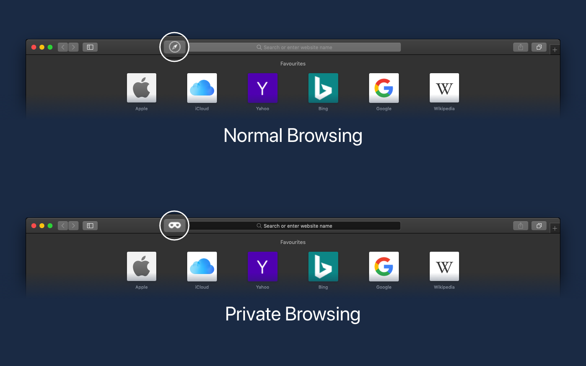

_Is It Private_ is a Safari Extension providing a toolbar icon that changes its visual appearance if Private Browsing is enabled. This is especially helpful when the Dark appearance of macOS is activated.

## Support

If you encounter any problems, feel free to [open an issue](https://github.com/ffittschen/isitprivate/issues) on GitHub or [contact me](/contact).

## Privacy Policy

This privacy policy governs your use of the software application Is It Private (“Application”). The Application is a Safari App Extension providing a toolbar icon that changes its visual appearance if Private Browsing is enabled.

The Application does not store or transmit any personal details, nor does it include advertising, tracking software or analytics software that talks to third parties.